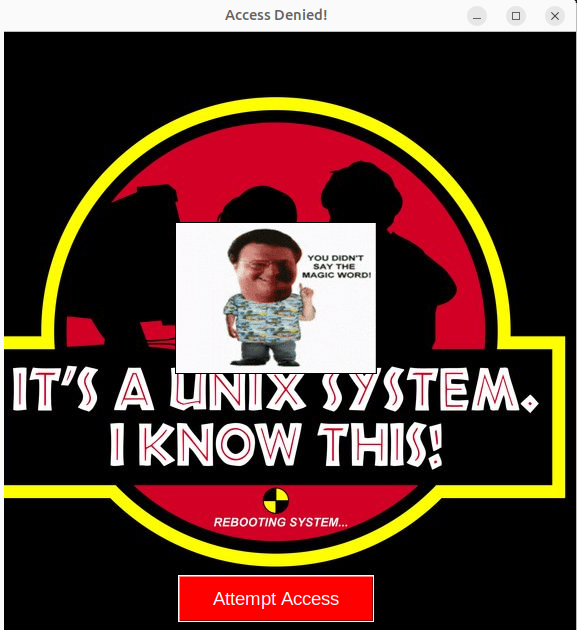

# Jurassic Park Unix system Access Denied 🦖🔒

A fun simulation inspired by *Jurassic Park*, where Dennis Nedry's infamous *"You didn't say the magic word!"* blocks access.

This python script creates a **fake login denial system**, displaying a looping GIF and playing an audio clip, with a UNIX-themed background.

## 📸 Preview


## 🛠 Features
- 🖥️ **GUI simulation** of a fake login system.
- 🎥 **Animated GIF** of Dennis Nedry saying *"You didn't say the magic word!"*.
- 🔊 **Sound effects** when attempting access.
- 🖼️ **Custom UNIX background** from the movie.
- 🎯 **Window auto-centering** on startup.
- ✅ **Linted and follows best practices (pylint 10/10).**

---

## 🚀 Installation & Usage
### **1️⃣ Install Dependencies**
Make sure you have Python 3 installed, then install required packages:

```bash
sudo apt install -yqq python3-tk python3.10-venv

python3.10 -m venv nedrytest
source nedrytest/bin/activate
pip install pillow pygame
```
**Note**: Only tested in Ubuntu/Debian distros.


### **2️⃣ Run the Program**
`
python terminal.py
`

### **3️⃣ Deactivate Virtual Environment when finished**
`
deactivate
`
